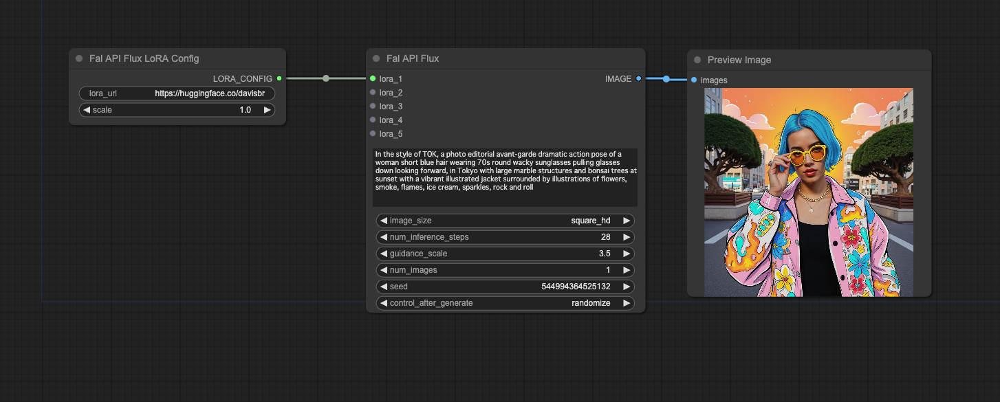

# ComfyUI-Fal-API-Flux



This repository contains custom nodes for ComfyUI that integrate the fal.ai FLUX.1 [dev] with LoRA API, specifically for text-to-image generation. These nodes allow you to use the FLUX.1 model directly within your ComfyUI workflows.

## Important Notes

- This node is specifically designed to work with the "FLUX.1 [dev] with LoRA" text-to-image model from fal.ai.
- Currently, the FLUX.1 model supports the use of only one LoRA at a time. While the node provides five LoRA input slots for future compatibility, only one should be used in the current version.

## Features

- Text-to-image generation using fal.ai's FLUX.1 [dev] model
- Support for a single LoRA model in the generation process
- Customizable generation parameters (image size, inference steps, guidance scale)
- Multiple image generation in a single request
- Seed support for reproducible results

## Prerequisites

- ComfyUI installed and set up
- Python 3.7+
- PyTorch 2.0.1 or later
- A fal.ai API key with access to the FLUX.1 [dev] with LoRA model

## Installation

1. Clone this repository into your ComfyUI's `custom_nodes` directory:
   ```
   cd /path/to/ComfyUI/custom_nodes
   git clone https://github.com/your-username/ComfyUI-Fal-API-Flux.git
   ```
2. Navigate to the cloned directory:
   ```
   cd ComfyUI-Fal-API-Flux
   ```
3. Install the required dependencies:
   ```
   pip install -r requirements.txt
   ```
4. Configure your API key (see Configuration section below)
5. Restart ComfyUI if it's already running

## Configuration

To use these custom nodes, you need to set up your fal.ai API key:

1. `config.ini` file is seen at the root directory.
2. The content of `config.ini` is here:
   ```ini
   [falai]
   api_key = your_api_key_here
   ```
3. Replace `your_api_key_here` with your actual fal.ai API key.
4. Save the file.

Keep your `config.ini` file secure and do not share it publicly.

## Usage

After installation, you'll find two new nodes in the ComfyUI interface:

1. "Fal API Flux": The main node for text-to-image generation using FLUX.1 [dev].
2. "Fal API Flux LoRA Config": A node for configuring a LoRA model to use with FLUX.1 [dev].

### Fal API Flux Node

The "Fal API Flux" node accepts the following inputs:

- **prompt** (required): The text prompt for image generation.
- **image_size** (required): Choose from predefined image sizes supported by FLUX.1 [dev].
- **num_inference_steps** (required): Number of inference steps (default: 28).
- **guidance_scale** (required): Guidance scale for generation (default: 3.5).
- **num_images** (required): Number of images to generate (default: 1, max: 4).
- **seed** (optional): Seed for reproducible results.
- **lora_1** to **lora_5** (optional): Connections for LoRA configurations (currently, only use one).

### Fal API Flux LoRA Config Node

The "Fal API Flux LoRA Config" node accepts:

- **lora_url** (required): URL of the LoRA model file compatible with FLUX.1 [dev].
- **scale** (required): Scale for the LoRA model (0.1-2.0, default: 1.0).

### Using LoRA with FLUX.1 [dev]

To use a LoRA model with the FLUX.1 [dev] model:

1. Add a "Fal API Flux" node to your workflow.
2. Add a "Fal API Flux LoRA Config" node.
3. Configure the LoRA URL and scale in the LoRA Config node.
4. Connect the output of the "Fal API Flux LoRA Config" node to the `lora_1` input on the main "Fal API Flux" node.
5. Configure the other parameters in the "Fal API Flux" node as needed.
6. Connect the output of the "Fal API Flux" node to a "Preview Image" or "Save Image" node to see the results.

Note: Although there are five LoRA input slots (lora_1 to lora_5), currently only one can be used. The additional slots are reserved for future updates when multiple LoRA support may be added.

### Example Workflow

An example workflow is provided in the `examples` folder of this repository. To use it:

1. Locate the file `examples/workflow_fal_api_flux_dev_with_lora.png` in the repository.
2. Open ComfyUI in your web browser.
3. Drag and drop the `workflow_fal_api_flux_dev_with_lora.png` file directly onto the ComfyUI canvas.
4. The example workflow will be loaded, demonstrating how to use the Fal API Flux nodes with a LoRA model.

This example workflow provides a starting point for using the Fal API Flux nodes in your own projects. Feel free to modify and experiment with the parameters to suit your needs.

## Troubleshooting

If you encounter issues:

1. Ensure you have access to the FLUX.1 [dev] with LoRA model on fal.ai.
2. Check the ComfyUI console for detailed error messages and logs.
3. Verify that your API key is correctly set in the `config.ini` file.
4. Make sure your LoRA URL is correct and compatible with FLUX.1 [dev].
5. Remember that only one LoRA can be used at a time. If you connect multiple LoRAs, only the first one (connected to `lora_1`) will be used.
6. For persistent issues, enable debug logging and check the logs for API responses and image processing details.

## Contributing

Contributions to improve the nodes or extend their functionality within the scope of FLUX.1 [dev] with LoRA are welcome! Please feel free to submit issues or pull requests.

## License

This project is licensed under the MIT License - see the [LICENSE](LICENSE) file for details.

## Acknowledgements

- [fal.ai](https://fal.ai) for providing the FLUX.1 [dev] with LoRA API
- [ComfyUI](https://github.com/comfyanonymous/ComfyUI) for the extensible UI framework

## Disclaimer

This project is not officially affiliated with or endorsed by fal.ai or ComfyUI. Use it at your own risk and be sure to comply with fal.ai's terms of service when using their API. This node is specifically for the FLUX.1 [dev] with LoRA model and may not work with future versions or other fal.ai models without updates.
